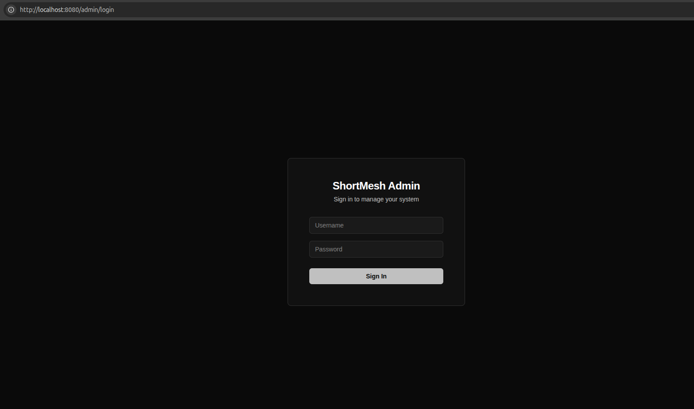
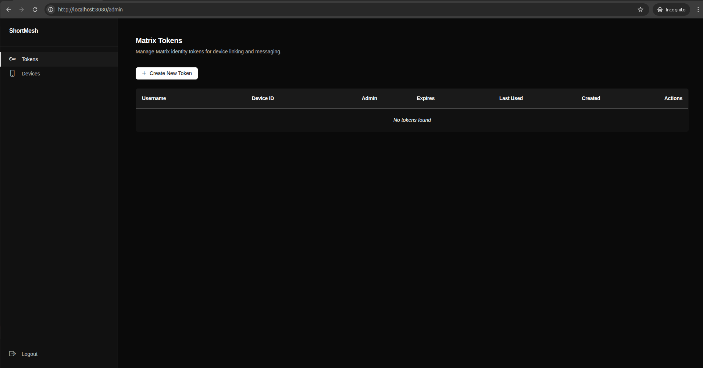
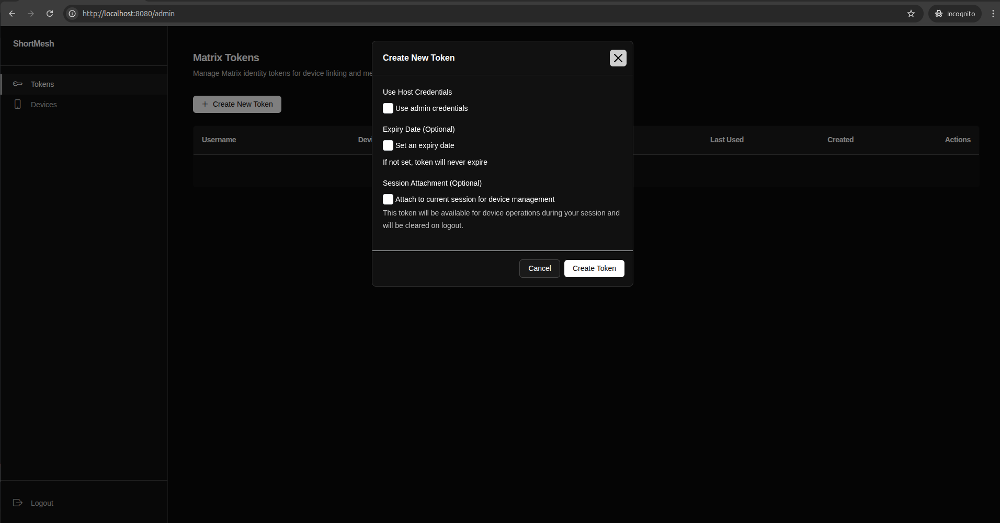
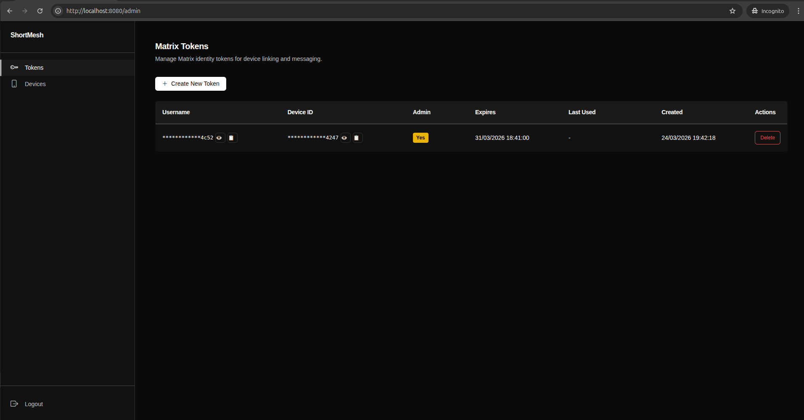
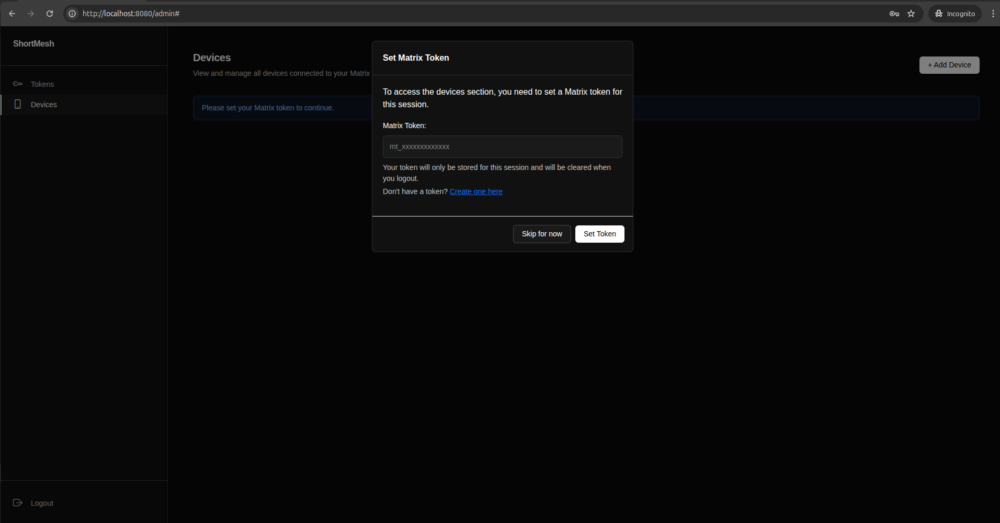
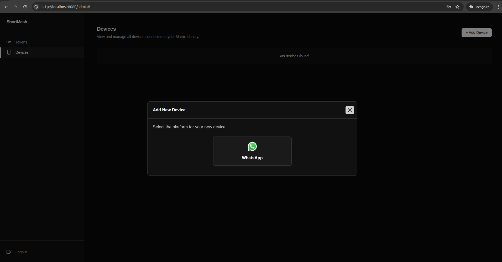
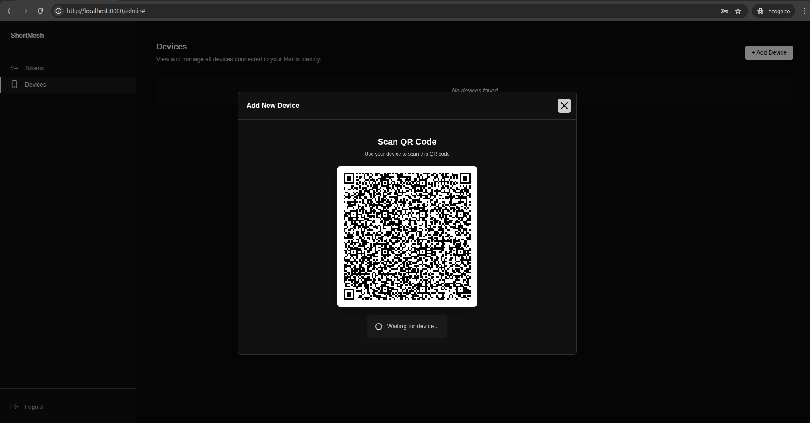
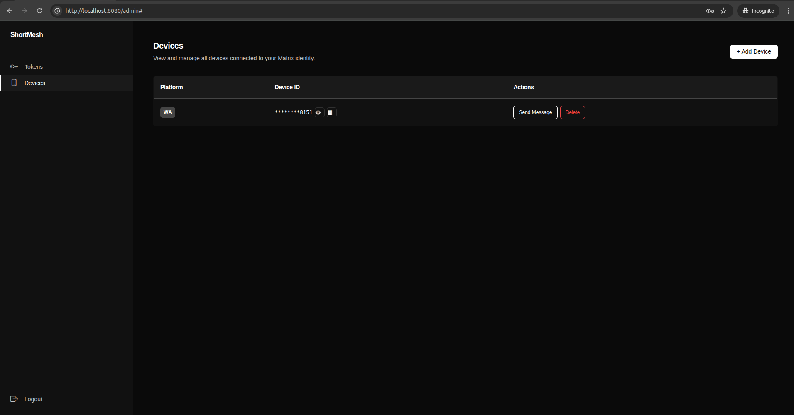
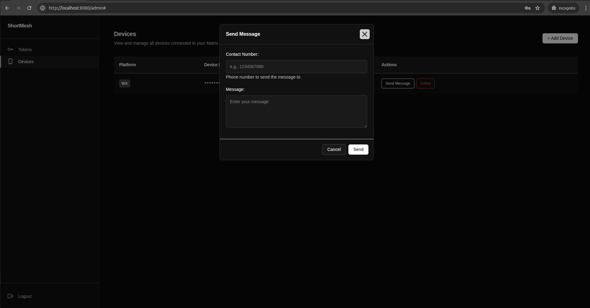

# Admin UI Management

## Table of Contents

- [Overview](#overview)
- [Login](#login)
  - [Credentials](#credentials)
  - [Session Details](#session-details)
- [Dashboard](#dashboard)
- [Matrix Tokens](#matrix-tokens)
  - [Token Types](#token-types)
  - [Creating Tokens](#creating-tokens)
  - [Viewing Tokens](#viewing-tokens)
  - [Deleting Tokens](#deleting-tokens)
- [Device Management](#device-management)
  - [Prerequisites](#prerequisites)
  - [Setting Matrix Token](#setting-matrix-token)
  - [Adding Devices](#adding-devices)
  - [Viewing Devices](#viewing-devices)
  - [Sending Test Messages](#sending-test-messages)
  - [Removing Devices](#removing-devices)
- [Common Workflows](#common-workflows)
  - [First-Time Setup](#first-time-setup)
  - [Adding API Access for Another User](#adding-api-access-for-another-user)
  - [Managing Multiple Devices](#managing-multiple-devices)
  - [Switching Between Tokens](#switching-between-tokens)
- [Security Best Practices](#security-best-practices)
- [Troubleshooting](#troubleshooting)
- [API Endpoints Reference](#api-endpoints-reference)
  - [Authentication](#authentication)
  - [Tokens](#tokens)
  - [Devices](#devices)
- [Advanced: Direct API Usage](#advanced-direct-api-usage)

## Overview

The Admin UI provides a web-based interface for managing Matrix tokens and devices. Access the dashboard at `http://localhost:8080/admin` (or your configured host/port).

## Login

### Credentials

Use your API credentials to log in:

- **Username**: `CLIENT_ID` from your `.env` file
- **Password**: `CLIENT_SECRET` from your `.env` file

To retrieve your credentials:

```bash
grep '^CLIENT_ID=' .env | cut -d'=' -f2
grep '^CLIENT_SECRET=' .env | cut -d'=' -f2
```

### Session Details

- Sessions expire after **2 hours** of inactivity
- Sessions are stored server-side for security
- Use the logout button to end your session manually



## Dashboard

After login, you'll see the main dashboard with navigation to:

- **Tokens** - Manage Matrix tokens
- **Devices** - Manage linked devices



## Matrix Tokens

Matrix tokens are authentication credentials that allow access to the API and control device operations.

### Token Types

**Admin Token** (First Token)

- Created automatically on first token generation
- Has full system access
- Creates the host Matrix identity

**Host Tokens** (`use_host: true`)

- Share the admin's Matrix credentials
- Access all devices linked to the host identity
- Useful for multiple API clients needing same device access

**Independent Tokens** (`use_host: false`)

- Create new Matrix user credentials
- Maintain separate device lists
- Isolated from other tokens

### Creating Tokens

1. Navigate to the **Tokens** page
2. Click **Create New Token**
3. Configure token settings:
   - **Use Host Credentials**: Check to share admin credentials (`use_host: true`), uncheck for independent token (`use_host: false`)
   - **Expiry Date**: Optional - check "Set an expiry date" to enable, defaults to 7 days from now (leave unchecked for no expiration)
   - **Session Attachment**: Check to automatically attach this token to your current session for immediate device management
4. Click **Create Token**
5. **Copy the token immediately** - it will not be shown again
6. Click "I've saved my token" to close

> [!WARNING]
> Store tokens securely. They cannot be retrieved after creation.



> [!TIP]
> If you checked "Attach to current session", the token will be automatically set for device operations. You can skip the "Set Matrix Token" step in the Devices section.

### Viewing Tokens

The tokens table displays:

- **Username** - Matrix username (masked by default, click 👁️ to reveal, 📋 to copy)
- **Device ID** - Matrix device ID (masked by default, click 👁️ to reveal, 📋 to copy)
- **Admin** - Badge showing if token has admin privileges
- **Expires** - Expiration date if set, or "-" for no expiration
- **Last Used** - Last time the token was used
- **Created** - Token creation timestamp
- **Actions** - Delete button



### Deleting Tokens

1. Locate the token in the tokens table
2. Click the **Delete** button
3. Confirm deletion in the popup

> [!WARNING]
> Deleting a token immediately revokes API access. Deleted tokens cannot be recovered.

## Device Management

Devices are messaging platform accounts (e.g., WhatsApp) linked to Matrix tokens.

### Prerequisites

Before managing devices, you must set an active Matrix token for your session.

### Setting Matrix Token

When you first visit the Devices page without an active token:

1. A modal will appear requesting a Matrix token
2. Enter your Matrix token (must start with `mt_`)
3. Click **Set Token**
4. Or click **Skip for now** and create a token from the Tokens page first



> [!TIP]
> The token is stored in your session and cleared when you logout. You can also automatically attach tokens during creation.

### Adding Devices

1. Navigate to the **Devices** page
2. Ensure a Matrix token is set (you'll be prompted if not)
3. Click **+ Add Device**
4. Select platform
5. A QR code will appear
6. Scan the QR code with your messaging app:
   - **WhatsApp**: Go to Settings > Linked Devices > Link a Device
7. Once scanned, you'll see "Device connected successfully!"
8. The modal will close automatically and refresh the devices list





> [!TIP]
> QR codes update in real-time via WebSocket. If there's a connection error, click "Try again" to reconnect.

### Viewing Devices

The devices table shows:

- **Platform** - Badge showing messaging platform (e.g., "wa" for WhatsApp)
- **Device ID** - Unique identifier like phone number (masked by default, click 👁️ to reveal, 📋 to copy)
- **Actions** - Send Message and Delete buttons



### Sending Test Messages

1. Locate a device in the devices table
2. Click **Send Message**
3. Enter recipient details:
   - **Contact Number**: Phone number without special characters (e.g., `1234567890`)
   - **Message**: Text content to send
4. Click **Send**
5. Message is queued for delivery



### Removing Devices

1. Locate the device in the devices table
2. Click **Delete**
3. Confirm removal in the popup

> [!WARNING]
> Deleting a device unlinks it from the API. You'll need to scan a new QR code to re-link.

## Common Workflows

### First-Time Setup

1. Log in with `CLIENT_ID:CLIENT_SECRET`
2. Navigate to Tokens page
3. Create first token (automatically becomes admin)
   - Check "Attach to current session" for immediate use
4. Navigate to Devices page
5. Add your first device by scanning QR code
6. Test by sending a message

### Adding API Access for Another User

1. Create a new token:
   - Use `use_host: true` (check "Use Host Credentials") to share your devices
   - Use `use_host: false` (uncheck) for isolated access
   - Optionally set expiration date
2. Copy and securely share the token
3. User can now access API with the token via Bearer authentication

### Managing Multiple Devices

1. Ensure Matrix token is set in your session
2. Add multiple devices by repeating the Add Device process
3. Each token can have multiple linked devices
4. Host tokens share all devices; independent tokens have separate device lists

### Switching Between Tokens

1. Navigate to Devices page
2. When prompted, enter a different Matrix token
3. Click **Set Token**
4. You'll now see and manage devices for that token

## Security Best Practices

- **Never share your `CLIENT_ID` and `CLIENT_SECRET`** - these are system administrator credentials
- **Store Matrix tokens securely** - they provide API access
- **Set expiration dates** for temporary access tokens
- **Review and delete unused tokens** regularly
- **Log out** when finished using the admin UI
- **Use independent tokens** (`use_host: false`) when sharing access to avoid exposing all devices
- **Matrix tokens are stored in session** - they're cleared on logout for security

## Troubleshooting

**Can't log in**

- Verify `CLIENT_ID` and `CLIENT_SECRET` in `.env`
- Check for typos or extra whitespace
- Check server logs for authentication errors

**"Please set your Matrix token to continue"**

- Click the prompt and enter a valid Matrix token (starts with `mt_`)
- Or navigate to Tokens page and create a new token with "Attach to current session" checked

**QR code not appearing**

- Ensure Matrix token is set for the session
- Check Matrix Client service is running
- Wait the full 5 seconds during device setup
- Check browser console for WebSocket errors
- Click "Try again" if connection fails

**"Connection error" during QR code scan**

- Check Matrix Client service is running and accessible
- Verify WebSocket connection is allowed through firewalls
- Click "Try again" to reconnect

**Device not appearing after scan**

- Wait for the success message (up to 2 seconds)
- The modal closes automatically and refreshes the list
- If device doesn't appear, refresh the page manually
- Check Matrix Client logs for device registration errors

**"Matrix token not set" error**

- Navigate to Devices page to trigger the token prompt
- Enter your Matrix token in the modal
- Or create a new token with "Attach to current session" enabled

**Session expired**

- Sessions last 2 hours
- You'll be redirected to login automatically
- Log in again to continue

**Token validation error**

- Ensure token starts with `mt_`
- Verify token exists in the database (check Tokens page)
- Token may have been deleted or expired
