# Send Message Flow

## Sequence Diagram

```mermaid
sequenceDiagram
    participant Client
    participant API as API Server
    participant DB as Database
    participant RMQ as RabbitMQ
    participant Worker as Message Worker
    participant Throttler
    participant MC as Matrix Client

    Client->>API: Send message request
    API->>API: Validate request
    API->>DB: Retrieve user matrix profile
    DB-->>API: Matrix profile
    API->>API: Decrypt credentials
    API->>RMQ: Publish message to exchange
    RMQ-->>API: Acknowledgment
    API-->>Client: Message queued
    
    Note over Worker,RMQ: Worker subscribed to exchange
    
    RMQ->>Worker: Deliver message
    Worker->>Throttler: Check rate limit
    
    alt Rate limited
        Throttler-->>Worker: Deny
        Worker->>RMQ: Publish to delay queue
        Worker->>RMQ: Acknowledge message
        Note over RMQ: Message waits in delay queue
    else Rate limit OK
        Throttler-->>Worker: Allow
        Worker->>MC: Forward message
        
        alt Success
            MC-->>Worker: Success
            Worker->>RMQ: Acknowledge message
        else Failure
            MC-->>Worker: Error
            Worker->>RMQ: Discard message
        end
    end
```

## Components

- **API Server**: Validates requests, retrieves user credentials, publishes to message queue
- **RabbitMQ**: Topic exchange routes messages based on platform and user
- **Message Worker**: Consumes messages, enforces rate limits, forwards to Matrix Client
- **Throttler**: Per-platform/user rate limiting with delay queue mechanism
- **Matrix Client**: External service handling actual message delivery to platforms

## Error Handling

- **Rate Limited**: Messages are delayed and retried
- **Matrix Client Errors**: Messages are discarded without retry
