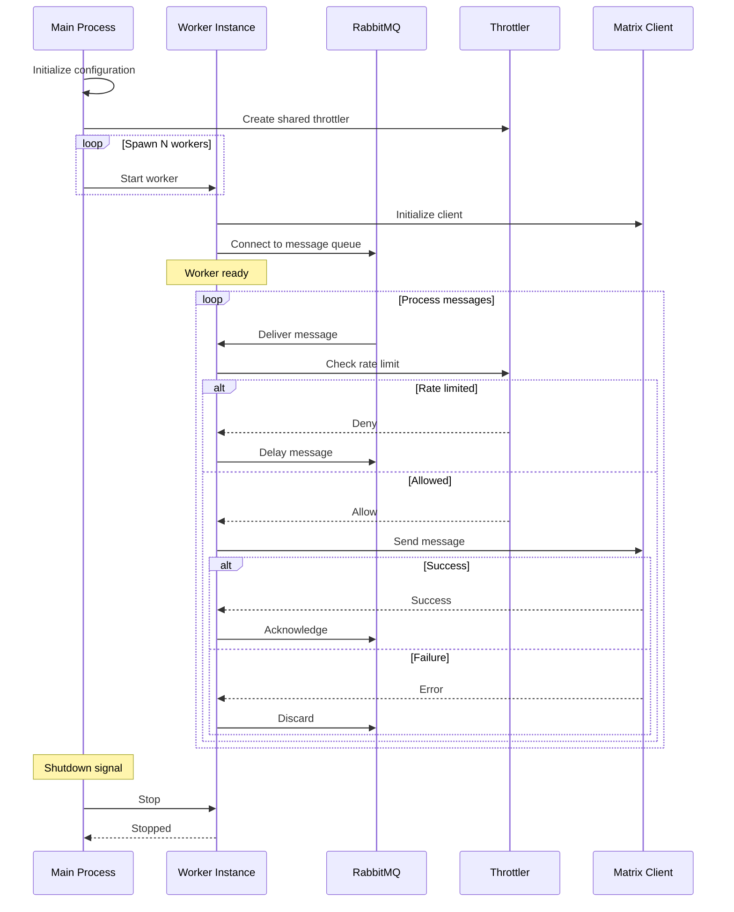

# Worker Flow

## Sequence Diagram

## Message Flow

1. **Initialization**: Workers connect to RabbitMQ and Matrix Client
2. **Consumption**: Workers receive messages from the queue
3. **Rate Limiting**: Throttler checks if message can be sent immediately
4. **Delivery**: Messages are forwarded to Matrix Client
5. **Acknowledgment**: Successful deliveries are acknowledged, failures are discarded
